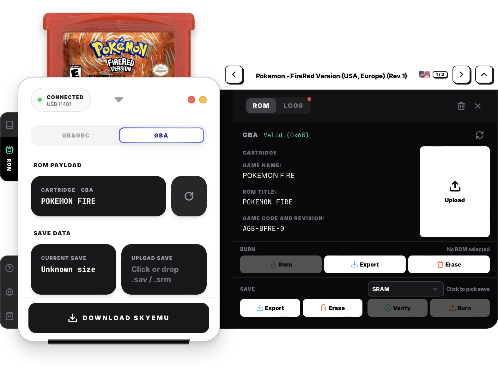

# 🔥 Chis Flasher

[English](README.md) · [简体中文](docs/readme/zh-CN.md) · [日本語](docs/readme/ja.md) · [한국어](docs/readme/ko.md) · [Español](docs/readme/es.md) · [Français](docs/readme/fr.md) · [Deutsch](docs/readme/de.md) · [Русский](docs/readme/ru.md)

Desktop app for writing **GB / GBC / GBA** ROMs to [ChisFlash](https://github.com/ChisBread/ChisFlash) cartridges. 🎮

  

## ✨ Features

- 🔥 Burn GB / GBC / GBA ROMs to ChisFlash cartridges
- 💾 Read / write / erase / verify save data
- 🔍 Detect cartridge info and manage multiple flashers
- 🕹️ Optional SkyEmu DirectPlay for reading the cart live
- ⌨️ Boss key to instantly hide the window (`Ctrl/Cmd+B`)
- 📸 One-key window screenshot for bug reports (`Ctrl/Cmd+P`)

## 🛠️ GBMake

Pair with **[GBMake](https://www.gbmake.com)** for full custom cartridge reproduction:

- 🏷️ **Stickers** — [A4 sticker sheet](https://gbmake.com/customization/pages/cartridge-sticker) · [Single sticker editor](https://gbmake.com/customization/pages/cartridge-sticker/single)
- 🐚 **Shells** — [GB](https://www.gbmake.com/products/cartridge-shell-gb) · [GBC](https://www.gbmake.com/products/cartridge-shell-gbc) · [GBA](https://www.gbmake.com/products/cartridge-shell-gba)
- 🟩 **PCBs** — [GBA custom PCB](https://www.gbmake.com/products/cartridge-pcb-gba) · [GB/GBC custom PCB](https://www.gbmake.com/products/cartridge-pcb-gb-gbc)
- 🃏 **Cartridges** — [Premium GBA](https://www.gbmake.com/products/cartridge-gba) · [Premium GB/GBC](https://www.gbmake.com/products/cartridge-gb-gbc)
- 🔥 **Burners** — [ChisFlash Burner](https://www.gbmake.com/products/chisflashburner)
- 🧱 **Stands** — [GBA stand](https://www.gbmake.com/products/console-stand-gba) · [GB/GBC stand](https://www.gbmake.com/products/console-stand-gb-gbc)
- 🛍️ **All products** — [GBMake Store](https://www.gbmake.com/store)
- 🧩 **Game Boy Mods** — [mod](https://www.gbmake.com/mod): organized showcase of every Game Boy mod part

End-to-end customization from artwork to hardware.

## 📥 Download

Latest installers (Windows NSIS · macOS DMG): [Releases](https://github.com/eyenobig/beggar_chis/releases/latest)

## 🙏 Thanks

Thanks to **ChisTeam** and the open-source [ChisFlash](https://github.com/ChisBread/ChisFlash) project — this app exists to work with their flashcarts.

## 📄 License

GPL-3.0-only
